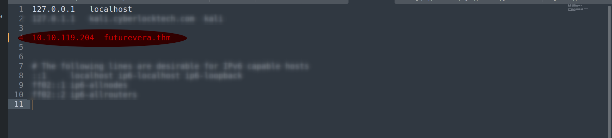
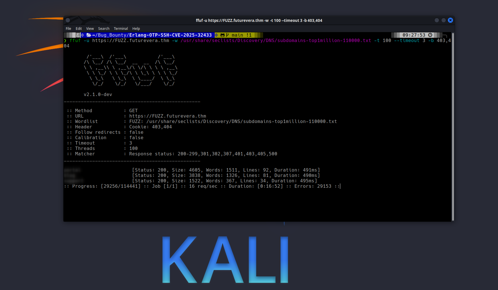
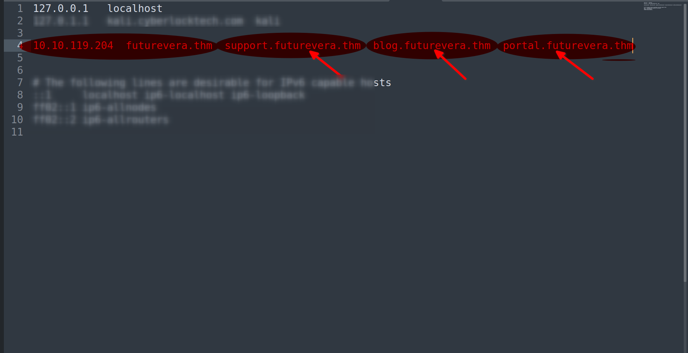
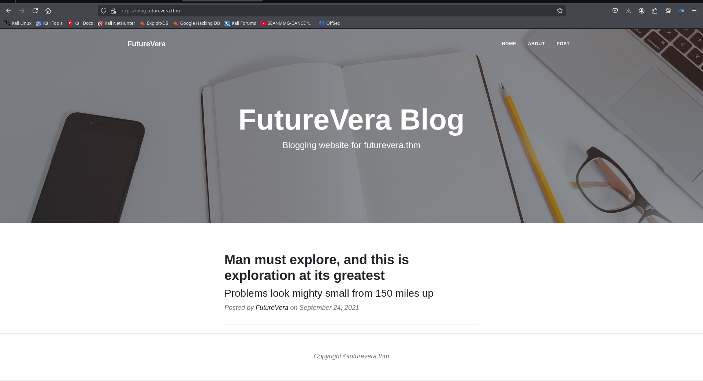
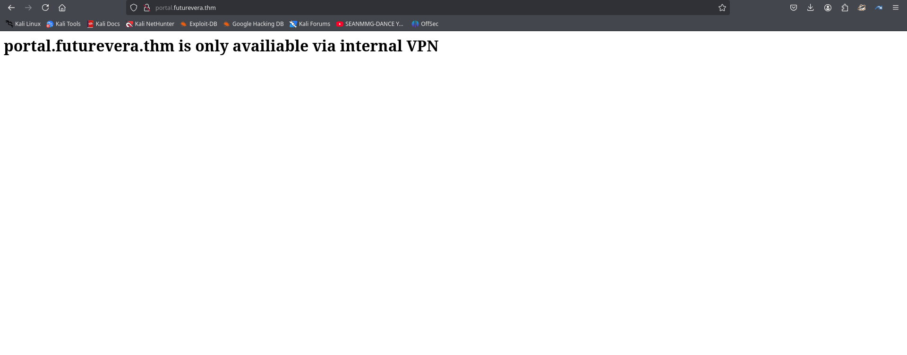
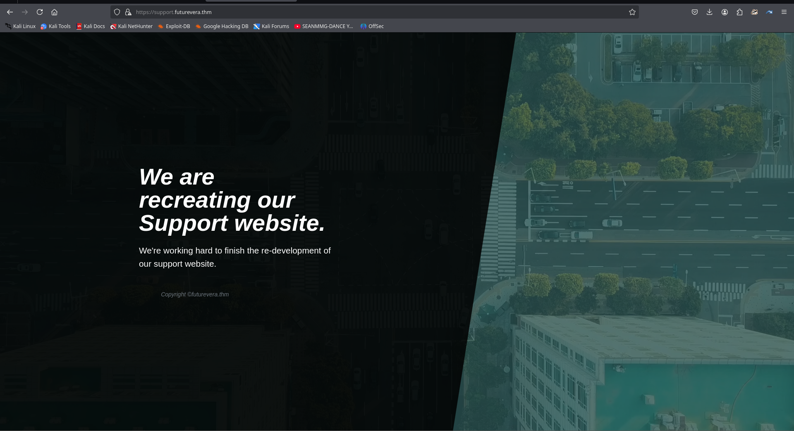
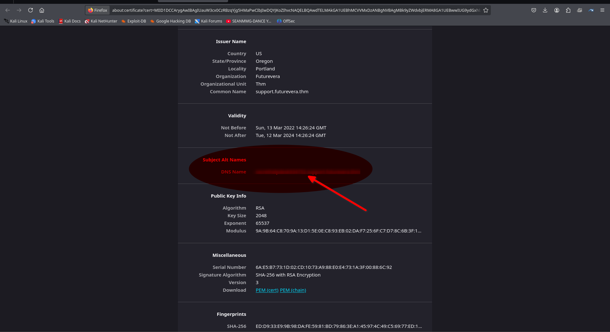
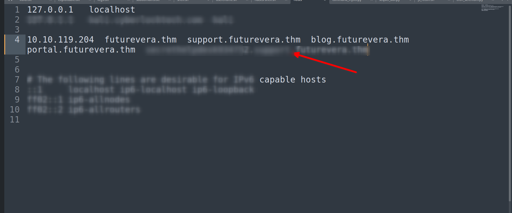
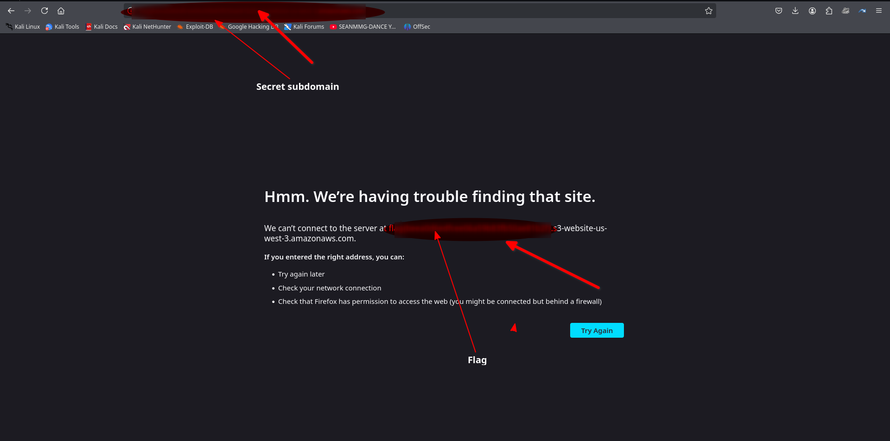

# TakeOver

This challenge revolves around subdomain enumeration.

Hello there,

I am the CEO and one of the co-founders of futurevera.thm. In Futurevera, we believe that the future is in space. We do a lot of space research and write blogs about it. We used to help students with space questions, but we are rebuilding our support.

Recently blackhat hackers approached us saying they could takeover and are asking us for a big ransom. Please help us to find what they can takeover.

Our website is located at https://futurevera.thm

Hint: Don't forget to add the 10.10.119.204 in /etc/hosts for futurevera.thm

## 📝 Summary

In this challenge, I gained unauthorized access to an internal support subdomain by enumerating DNS records and parsing certificate data. By chaining directory fuzzing and weak configuration logic, I achieved a web-based subdomain takeover.

## 🧰 Tools Used

    gobuster, ffuf

    openssl

    dig

    nmap

    Web browser

    Wordlists: Seclists

    /etc/hosts editing

## 🚀 Step-by-Step Walkthrough

1️⃣ Initial Recon & Setup
Downloaded and connected to the THM machine.

Added base domain to /etc/hosts:

Verified web service running:

    http://futurevera.thm

This allow you to access the web interface of the challenge in the browser

2️⃣ Subdomain Enumeration
Used Gobuster in vhost mode with a top subdomain list:

    gobuster vhost -u http://futurevera.thm -w /usr/share/dnsrecon/dnsrecon/data/subdomains-top1mil-20000.txt -t 50

This was unsuccessful, I resolved to using ***ffuf*** tool

Used ***ffuf*** in  mode with a top subdomain list:

     ffuf -u https://FUZZ.futurevera.thm -w /usr/share/seclists/Discovery/DNS/subdomains-top1million-110000.txt -t 100 --timeout 3 -b 403,404

This fuzzing found a few subdomains

Add this subdomain to the /etc/hosts file and try acccessing them via the web browser

Accessing this subdomains through the web browser was successful but they didnt give me much information to work with

Heres the web images

However, this was unsuccessful due to SSL/TLS errors. So I pivoted to passive recon...

3️⃣ Certificate Inspection

I Used openssl to check for hidden SAN entries in the SSL certificate:

    openssl s_client -connect futurevera.thm:443

The certificate retrieved is

Self-signed
Expired (March 2023)
Only issued for futurevera.thm — no Subject Alternative Names (SANs) listed or visible in the output.

But there was no much information with this method so I resolved to investigating each subdomain certificate through the web-browser

## Discovering a Hidden Subdomain (No Openssl Required)

Navigated to:

    https://support.futurevera.thm
Steps:

In the browser (Chrome/Firefox):

Clicked the padlock 🔒 in the address bar.

Chose "Certificate" > "Details".

Located the Subject Alternative Name (SAN) field.

📌 Found:

DNS Name:

***This hinted at a hidden subdomain with potential misconfiguration.***

## Mapping the Subdomain

Added the newly discovered subdomain to /etc/hosts:

Accessed the found subdomain in the browser:

## ✅ Conclusion

This TakeOver challenge demonstrates the critical importance of thorough reconnaissance and understanding how misconfigurations in DNS and certificate management can lead to serious vulnerabilities. By using nothing more than a browser's certificate viewer, I was able to identify a hidden subdomain that served as the entry point for a potential subdomain takeover.
